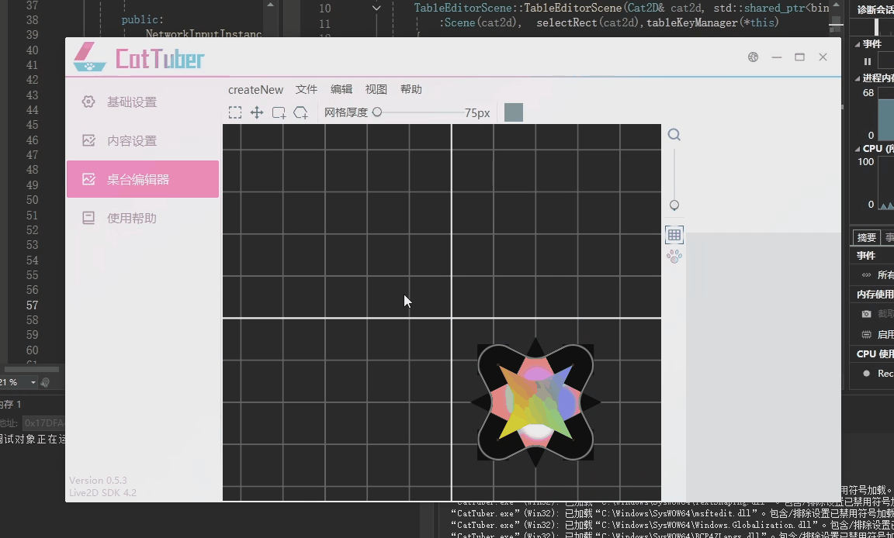
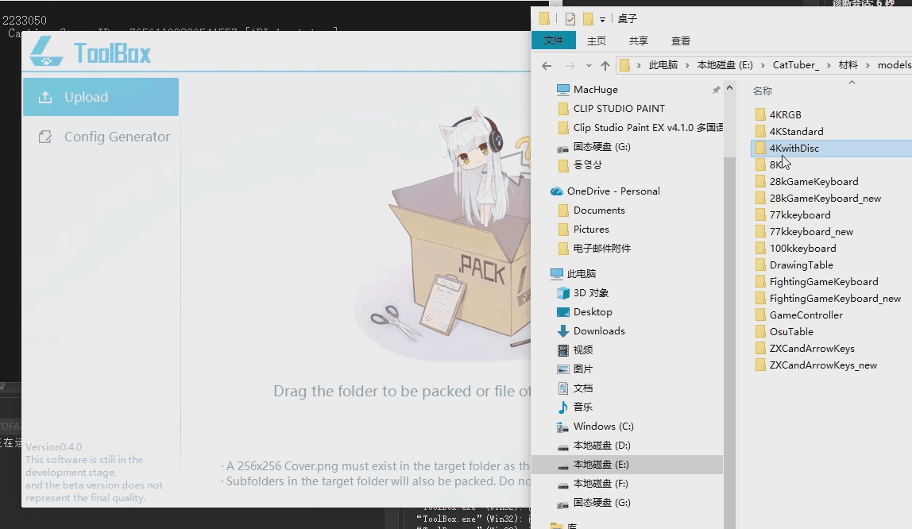

# CatTuber

此库为CatTuber64位版本（原CatTuber进行64bit跨平台迁移重构的版本）的核心源码（开发中），公开是为了让大家监督工作、大致了解CatTuber的开发进度。**开源不代表我放弃CatTuber及其源码的任何权利**。

因个人原因拖更过久致歉，我会竭尽全力让CatTuber成为质量超越价格的软件。

## 当前正在推进的内容

 - 64bit、跨平台重构（渲染系统由Direct3D迁移至SDL3 GPU、UI从原只支持windows的NIMDUI迁移至另一个跨平台的duilib）（计划先支持MacOS，后续支持Linux，但不会在下一个更新就支持MacOS，因为没有搭起来CatTuber的Mac开发环境）
 - 趁着重构重新设计UI交互，以让CatTuber用起来更简单。
 - 重新设计2D模型系统，以支持更强大的拓展性、模型之间的交互性。（为Spine模型甚至3D模型做准备）
 - 可编辑桌面系统（用户可以在网点阵列中自行设计自己的键盘而不需要有任何的美术基础）

 - 创意工坊

### Q: 为什么明明有创意工坊功能（有上传一个模型），但迟迟不开放其他用户上传？
A：创意工坊功能没有在技术上受阻。暂不开放是两方面原因，一个是一开始没有找到合适的上传方案。初始设计为将CatTuber本体和创意工坊上传工具切分为两个单独的程序。开发了一段时间后觉得有点多此一举就放弃了这个路线，最终还是决定直接集成在本体软件中。（创意工坊里那个模型便是用这个工具上传的）

另一个原因，同时也是主要原因，就是上面提到的2D模型系统重新设计。旧版本CatTuber的模型系统不成熟，CatTuber的模型系统将会被重新设计，现阶段做的模型并不符合未来CatTuber的模型标准，我希望在模型系统重置完后再开放创意工坊。

### Q: 未更新的这段时间开发者在做什么？

A：这里会诚实说明这段时间里我做的与CatTuber有关的和无关的事项。

上架CatTuber后，我除了初期修复一些BUG、加入面捕、虚拟摄像头、整合Bongo Cat之外，之后确实中断开发了一年多的时间。这一年多主要是在上课学习提升，主要是学习软件架构，计算机图形相关的系统知识，以及学习绘画。

之后是推进CatTuber->休息并进行一些其他内容创作或学习新技术->推进CatTuber的周期循环。

其中“休息并进行其他内容的创作或学习新技术”包括：影之诗逆向以及一个未公开的外挂研究（沉迷了一段时间影之幻境），UNITY游戏通用的基于UNITY编辑器的模组制作方法研究（未公开），Mac/Windows的CSP逆向及其插件开发，视频创作，一个针对绘画场景的Windows向ipad通过USB或无线进行极低延迟无损投屏的app（未公开）。

其中CatTuber的推进为开发本体的创意工坊系统->开发创意工坊上传软件（并弃用）->研究可编辑桌面系统并进行初步开发->SDL3推出跨平台渲染接口外加有人对NIMDUI进行跨平台改造，CatTuber因此有了比较好的跨平台依赖，并因为想修改的地方本身也不少，所以决定进行整体重构，开发了Live2D的SDL3渲染后台，并也将CatTuber内各项除Live2D模型之外的基础渲染也改用SDL3进行实现->进行模型交互逻辑的重新设计，从“按参数”进行位置匹配（先记录角色的手模型在某XY参数下，能按在某按键上，那么CatTuber将通过将手的模型设置为XY参数来实现按键）改为“按坐标”进行位置匹配（手模型和按钮模型重合时视为按下）->UI交互的重新设计（正在进行中）

再次为我个人效率偏低以及将部分时间花在了其他地方致歉。